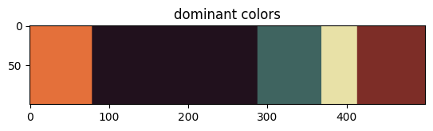

# Image-Color-Analyzer-Dominant-Colors-Extraction
This project provides a Python-based image color analyzer that utilizes the K-Means Clustering algorithm to extract the dominant colors from an image. The tool allows users to gain insights into the color composition of images and can be used for various applications such as image processing, design, and data visualization.

---

---

---

